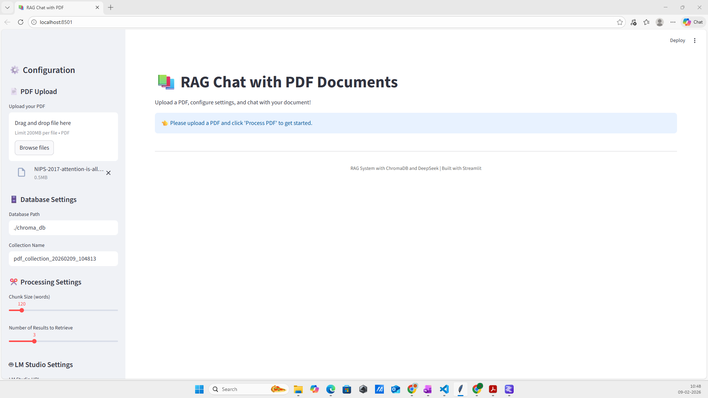
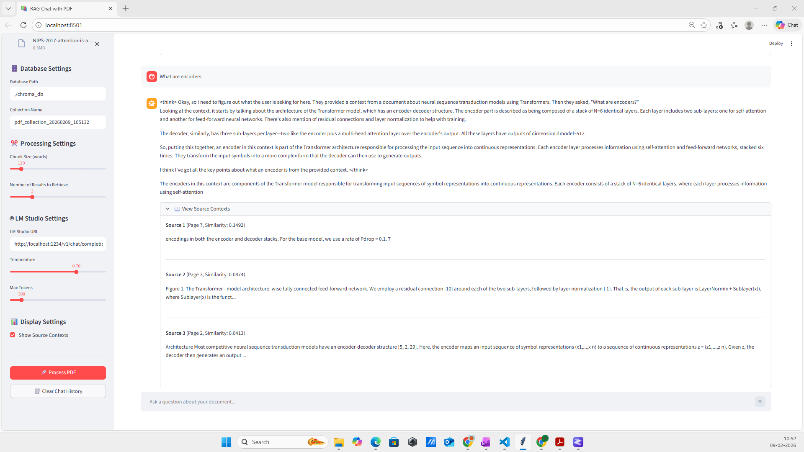

# Local PDF Chat Application (RAG)

A lightweight **local Retrieval-Augmented Generation (RAG)** application that enables conversational question-answering over uploaded PDF documents.  
This project runs **fully offline**, using **ChromaDB** for vector storage and **LM Studio** for a locally hosted Large Language Model (LLM).

---

## 🚀 Features

- 💬 Chat with uploaded PDF documents
- 📚 PDF text extraction using **PyPDF**
- 🔎 Semantic search with **Sentence Transformers**
- 🧠 Vector storage and retrieval using **ChromaDB**
- 🤖 Local LLM inference via **LM Studio API**
- 🔐 Fully offline & privacy-friendly
- ⚡ Fast embeddings with **PyTorch**

---

## 🧱 Architecture Overview

1. **PDF Upload**
2. **Text Extraction** (PyPDF)
3. **Text Chunking**
4. **Embedding Generation** (Sentence Transformers)
5. **Vector Storage** (ChromaDB)
6. **Semantic Retrieval**
7. **Prompt Construction**
8. **Local LLM Response** (LM Studio)

---

## 🛠️ Tech Stack

| Component | Library / Tool |
|---------|---------------|
| Vector Database | chromadb |
| PDF Parsing | pypdf |
| Embeddings | sentence-transformers |
| LLM Hosting | LM Studio (local server) |
| HTTP Client | requests |
| Deep Learning | torch |
| Language | Python |

---

## 📦 Requirements

- Python **3.9+**
- LM Studio installed and running locally
- A downloaded local LLM model (e.g., Mistral, LLaMA, Phi)

---
### Application Screenshots

## 👨‍💻 Developer Info

**Name:** Manjunath C Bagewadi  
**Email:** manjunathsept11@gmail.com  
**Porfolio:** www.manjunathbagewadi.in  
**LinkedIn:** [linkedin.com/in/manjunath-bagewadi-9325ab55](https://www.linkedin.com/in/manjunath-bagewadi-9325ab55)